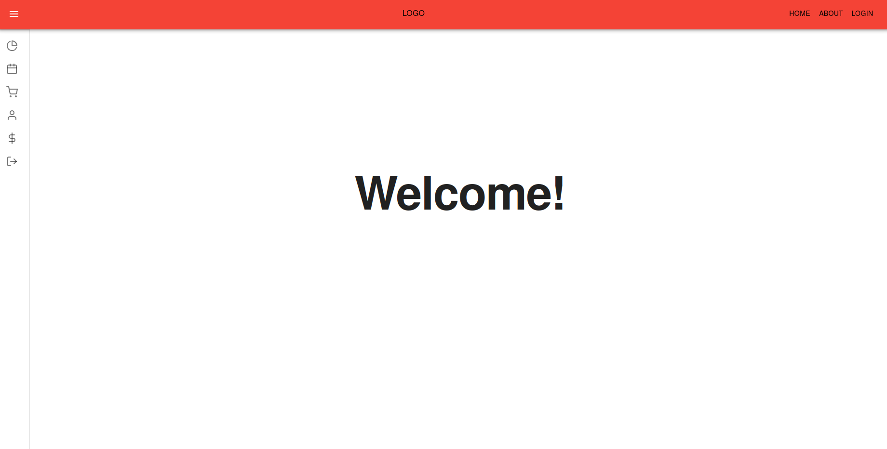
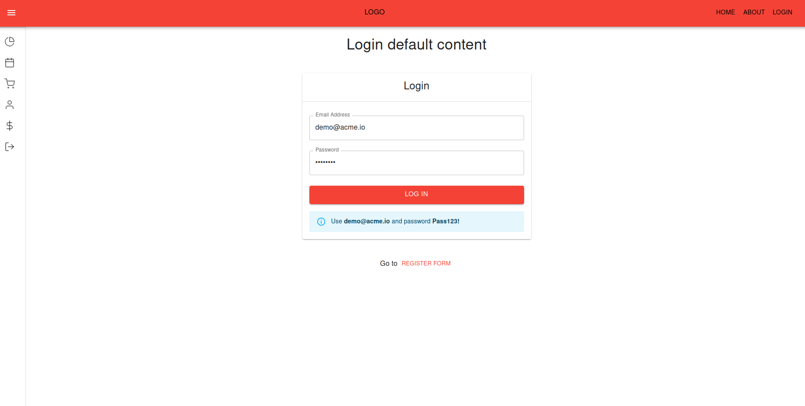

# Enterprise-level ReactJS+Typescript+Redux Boilerplate Dashboard App

---

This app aims to be a sort of boilerplate for my enterprise-level future projects. 
It implements: best practices, patterns and design; latest technologies and optimal scalable modular architecture. 
It has been deployed on Netlify and packaged in a [hub.docker.com](https://hub.docker.com/r/francescobilotta/enterprise-level-boilerplate-dashboard-app) repository.

- **_[Live Demo](https://brilliant-praline-4a8743.netlify.app/)_**

## Screenshots of Features

<table>
    <tr>
        <tr>
            <th>Homepage and Responsive Layout</th>
            <th>Calendar and Notification System (Working)</th>
        </tr>
        <tr>
            <td valign="top">
                
            </td>
            <td valign="top">
                
            </td>
        </tr>
    </tr>
    <tr>
        <tr>
            <th>Login/Registration with JSON Web Token for Restricted Access To Page (Working)</th>
            <th>List of Available Products with Info (Working)</th>
        </tr>
        <tr>
            <td valign="top">
                
            </td>
            <td valign="top">
                
            </td>
        </tr>
    </tr>
    <tr>
        <tr>
            <th>Complete Product Creation Form (Working) + File upload (To finish)</th>
            <th>Sales Data Visualization (Working)</th>
        </tr>
        <tr>
            <td valign="top">
                
            </td>
            <td valign="top">
                
            </td>
        </tr>
    </tr>
    <tr>
        <tr>
            <th>Pricing Page (Aesthetics)</th>
            <th>Complete Account and Subscription Settings (Aesthetics)</th>
        </tr>
        <tr>
            <td valign="top">
                
            </td>
            <td valign="top">
                
            </td>
        </tr>
    </tr>
</table>

## Disclosure

my-json-server.typicode.com, a free service that acts like JSON-Server doesn't provide authentication, and for that reason JWT authentication can't be used.
I removed login from all routes that needed it so you can test the live application.

## Technology and Packages used:

- Framework/Library: **React v18 with create-react-app** and **Typescript v4.8** (latest versions nowadays)
- Routes Management: **React Router Dom v6** (latest nowadays)
- State Management: **Redux Toolkit + Redux persist**
- UI Kit: **Material UI v5** (latest nowadays)
- UI Icons: **Material Icons + React Feather**
- Notification library: **Notistack**
- Form library: **Formik**
- Data Validation: **Yup**
- Date manipulation library: **Moment**
- Data Visualization: **React Apexcharts**
- File Upload: **React Dropzone**
- Event Calendar: **Fullcalendar**
- Deployment: **Netlify + my-json-server.typicode.com**
- DevOps: **Docker**

## Development Packages and Tools used:

- Linting: **Eslint** (also auto-fix)
- Formatting: **Prettier**
- Api: **JSON-Server**
- Githook: **Husky** (to perform linting and formatting before commits)

## How I worked on this project

This project has been inspired and coded along to _Practical Enterprise React - Become an Effective React Developer in Your Team_ (2011) by Duldulao B. Devlin and Cabagnot R. Jane.

Since 2011 many best practices, libraries and APIs changed though.
For that reason I coded along the book while studying nowadays docs and adapting everything by myself.

## How to navigate this project

- **src**: Contains the whole app project.
- **api**: Contains reusable code for interacting with an API, often in the form of API calls (ideally a server-cache tool like React Query or RTK Query could be used).
- **app**: Contains app-wide things like routes and redux store.
- **components**: Contains ad-hoc created components like inputs and forms.
- **constants**: Contains pre-defined values, namespaces and all sort of app-wide constants. In general reusable & immutable strings like URLs or Regex Patterns.
- **hooks**: Contains reusable React hooks like useAppSelector and useAppDispatch.
- **layouts**: Contains reusable Layout Components. A Layout Component is a component that composes the layout of a page. It will often import components such as app-bar, app-footer, app-side-nav. In that project just a single layout was implemented though.
- **models**: Contains types, yup validations rules and default values.
- **pages**: Contains Page Components. Each Page Component is associated with a route.
- **slices**: Contains redux store slices, where each is organized like that: sliceActionTypes, sliceAsyncActions, sliceSlice and an index file to export slice actions from an unified interface.
- **styles**: Contains reusable or global styles. In that project I've used only inline styling but I kept the folder as a best practice.
- **ui-kit**: **_It's a project of mine inside the project, it shouldn't exist in normal projects_**. In future I would like to create a low code full-stack software app, which uses a library full of reusable code to create the app. I simply started to outline the structure, the architecture and the usage.
- **utils**: Reusable utility functions. These functions should always be pure and produce no side-effects.
- **views**: Each route gives to the page a different content to render, and that folder contains each "content" of the whole application.

## Why I built the project this way

My plan is to become a senior full-stack developer eventually. But at the moment I'm just focusing on bettering as a front-end developer. For that reason I chose to use a JSON-server rather to create a custom one. I have intermediate backend knowledge as well though.

## If I had more time I would change this

- Some sections and functionalities of the webapp are there just for aesthetics. I would surely focus on them and implement them all.
- I would refactor and expand the components folder because some components aren't listed here but are hard-implemented in code without being abstracted.
- Add end-to-end tests.
- Document UI with storybook.
